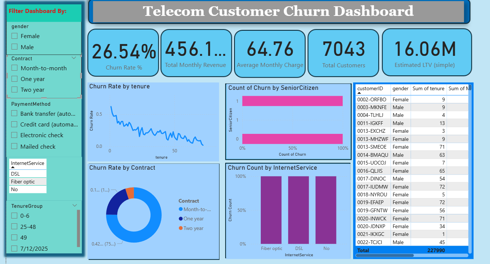

# 📊 Telecom Customer Churn Dashboard

This project analyzes **customer churn patterns** for a telecom company using **Power BI**.  
The dashboard provides actionable insights into customer behavior, churn rate, revenue, and demographics.

---

## 🚀 Features
- **Key Metrics (KPIs):**
  - Churn Rate (%)
  - Total Customers
  - Total Monthly Revenue
  - Average Monthly Charge
  - Estimated Lifetime Value (LTV)

- **Visualizations:**
  - Churn Rate by Tenure
  - Churn by Contract Type
  - Churn Count by Internet Service
  - Churn by Senior Citizens
  - Customer-level detailed table

- **Interactive Slicers:**
  - Gender
  - Contract Type
  - Payment Method
  - Internet Service
  - Tenure Groups

---

## 📂 Dataset
The dataset used is the **Telco Customer Churn Dataset**, containing:
- Customer demographics (gender, senior citizen, tenure, etc.)
- Services subscribed (Internet, Phone, etc.)
- Account details (contract, payment method, charges)
- Churn status (Yes/No)

---

## ⚙️ Tools & Technologies
- **Power BI Desktop**
- Data Cleaning: Power Query (M Language)
- Data Modeling & KPIs: DAX Measures

---

## 🎯 Insights
- Month-to-month customers show higher churn.
- Senior citizens churn more frequently.
- Fiber optic users have higher churn compared to DSL users.
- Longer tenure customers are less likely to churn.

---

## 📸 Dashboard Preview

---

## 📝 Author
Created by **[Your Name]** as part of a Data Analytics project using Power BI.  
